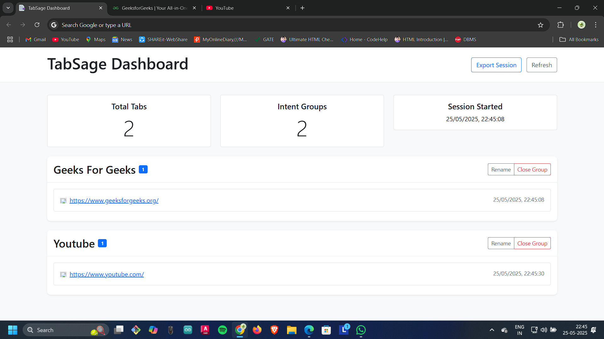
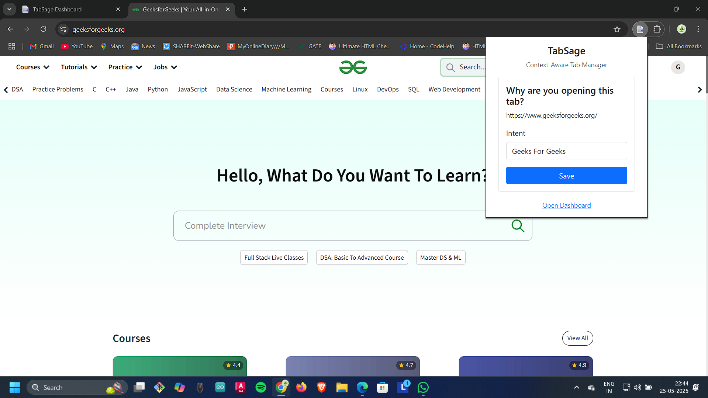

# TabSage - Context-Aware Chrome Tab Manager



## HackVortex 2025 Submission

### Problem Statement

In today's digital environment, users often find themselves overwhelmed with browser tabs, leading to:

- **Tab Overload**: The average user has 10-20 tabs open at once, causing cognitive burden
- **Lost Context**: No way to track why a tab was opened in the first place
- **Reduced Productivity**: Finding the right tab becomes time-consuming
- **Memory Drain**: Excessive tabs consume system resources

### Proposed Solution

TabSage offers a smart tab management system that:

1. **Captures Intent**: Records the purpose behind each tab you open
2. **Organizes Automatically**: Groups related tabs by their intended purpose
3. **Simplifies Management**: Provides intuitive dashboard for tab oversight
4. **Preserves Sessions**: Allows export of browsing sessions for future reference

### Innovation / Uniqueness

Most tab managers focus on basic organization or visual arrangement. TabSage takes a novel approach by:

- **Intent-First Design**: Focuses on the "why" before the "what"
- **Contextual Grouping**: Groups tabs by purpose, not just domain or time
- **Mindful Browsing**: Promotes conscious web usage by requiring intent declaration
- **Seamless Integration**: Works within Chrome's existing tab infrastructure

### Tech Stack

- **Frontend**: HTML5, CSS3, Bootstrap 5
- **Programming**: JavaScript (ES6+)
- **Storage**: Chrome Storage API
- **Extension Framework**: Chrome Extension Manifest v3
- **Icons/UI**: Custom-designed assets

### Impact

TabSage addresses critical issues in digital productivity:

- **Reduces Cognitive Load**: By organizing tabs meaningfully
- **Increases Productivity**: Users can quickly find relevant tabs
- **Promotes Digital Mindfulness**: Encourages purposeful browsing
- **Optimizes Memory Usage**: Easier identification of unnecessary tabs

### Screenshots / Demo

#### Dashboard View


_The main dashboard groups tabs by intent for easy management_

#### Quick Access Popup


_The popup interface for quick tab intent assignment_

### Installation & Usage

#### Installation

1. Download or clone this repository
2. Open Chrome and navigate to `chrome://extensions/`
3. Enable "Developer mode" at the top-right corner
4. Click "Load unpacked" and select the TabSage folder
5. The TabSage extension is now installed and ready to use

#### Usage

- **New Tab Intent**: Enter your purpose when opening a new tab via the popup
- **Tab Dashboard**: Access the dashboard when opening a new tab
- **Popup Access**: Click the TabSage icon in your toolbar to access the popup
- **Tab Groups**: Easily manage, close, or export related tabs
- **Intent Renaming**: Reorganize your tabs by updating their associated intents

### Future Scope

- **AI-Powered Intent Prediction**: Automatically suggest intents based on browsing patterns
- **Cross-Device Sync**: Synchronize tab groups across multiple devices
- **Time Management**: Track time spent on different browsing intents
- **Integration with Productivity Tools**: Connect with task managers and note-taking apps
- **Custom Visualization Options**: Different views for organizing and displaying tab groups

## File Structure

```
TabSage/
├── manifest.json       # Extension configuration
├── background.js       # Background service worker
├── popup/              # Browser action popup
│   ├── popup.html
│   └── popup.js
├── dashboard/          # New tab dashboard
│   ├── dashboard.html
│   └── dashboard.js
├── styles/             # Stylesheet directory
├── Screenshots/        # Application screenshots
│   ├── Dashboard.png
│   └── Pop_up.png
└── icons/              # Extension icons
    ├── icon_16.png
    ├── icon_32.png
    └── icon_192.png
```

## License

This project is licensed under the MIT License.

---

&copy; 2025 TabSage | HackVortex 2025 Submission
