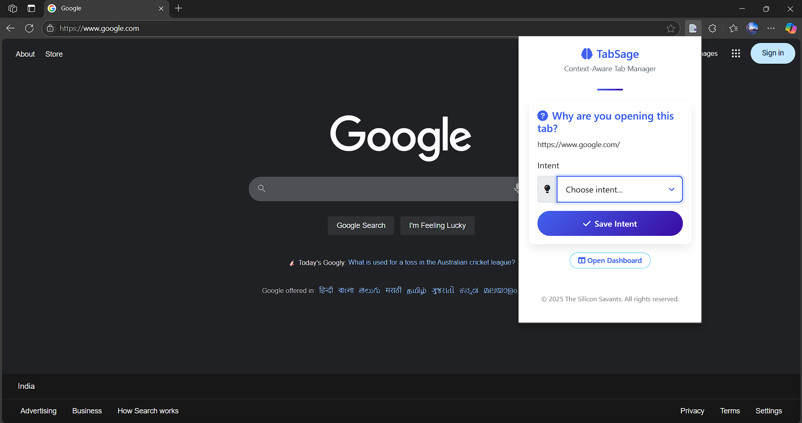
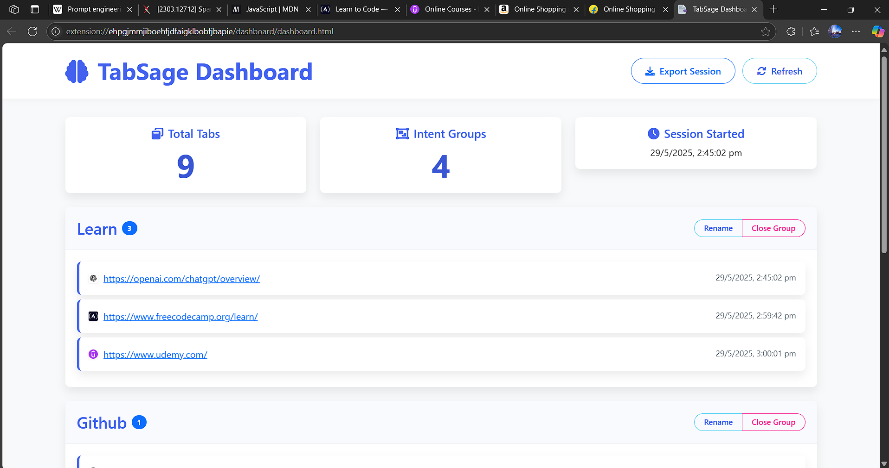
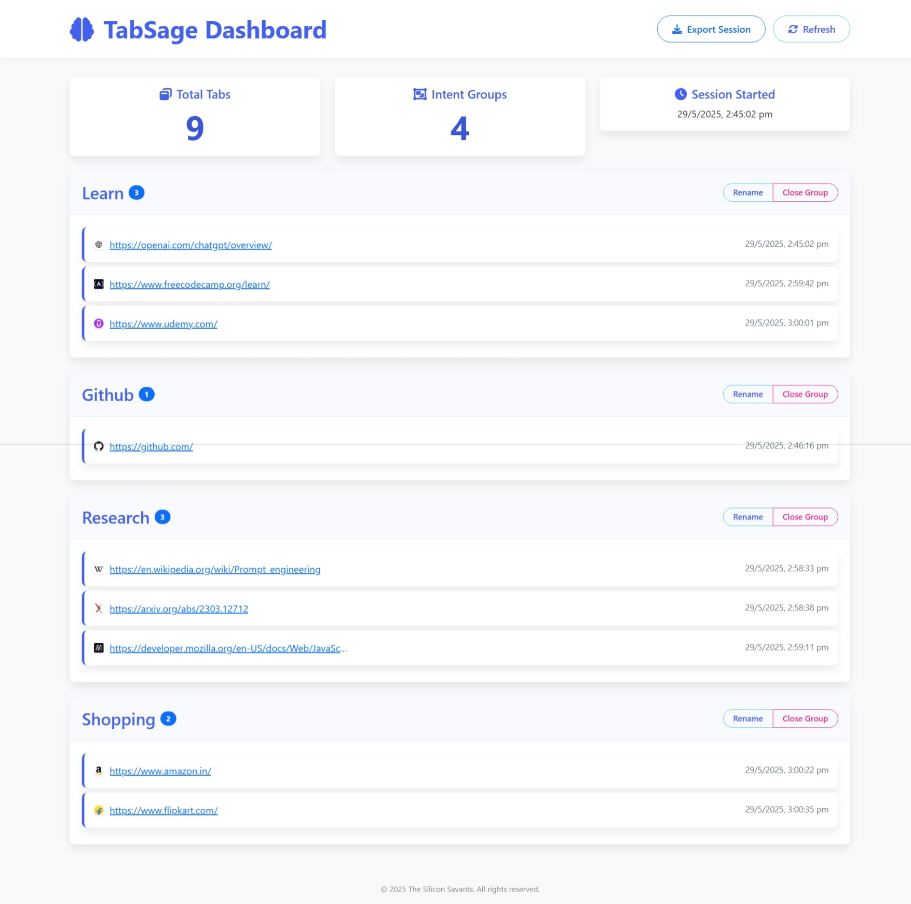
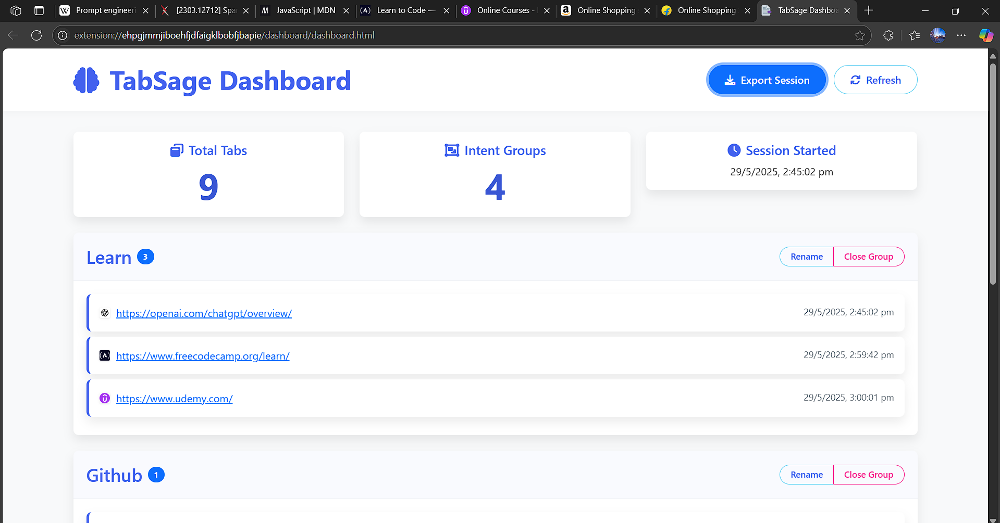

# TabSage - Context-Aware Chrome Tab Manager

<div align="center">
  
  <p><i>HackVortex 2025 Submission by Silicon Savants</i></p>
</div>

## 🧠 Overview

TabSage is a Chrome extension that helps you conquer tab overload by capturing the *intent* behind each tab you open. By requiring you to specify why you're opening a tab, TabSage transforms your browsing experience from chaotic to purposeful.

Unlike typical tab managers that focus only on visual organization, TabSage takes an intent-first approach: grouping your tabs by purpose, not just by domain or time opened.

## ✨ Features

- **Intent Capture**: Record the purpose behind each tab via a dropdown of common intents or custom entries
- **Dashboard View**: See all your tabs organized by intent groups for easier navigation
- **Tab Management**: Close entire groups of related tabs with one click
- **Export Sessions**: Save your browsing sessions as JSON for later reference or analysis
- **Intent Renaming**: Easily reorganize your tabs by updating their associated intent groups

## 📸 Screenshots

<table>
  <tr>
    <td width="50%">
      
      <p align="center"><strong>Intent Selection Popup</strong><br>Choose a predefined intent or create a custom one</p>
    </td>
    <td width="50%">
      
      <p align="center"><strong>Dashboard Overview</strong><br>Tabs organized by intent groups</p>
    </td>
  </tr>
  <tr>
    <td width="50%">
      
      <p align="center"><strong>Full Dashboard View</strong><br>Complete scrollable dashboard with stats</p>
    </td>
    <td width="50%">
      
      <p align="center"><strong>Export Feature</strong><br>Save your browsing session for later reference</p>
    </td>
  </tr>
</table>

**Sample Exported Session:**
```json
{
  "name": "TabSage Session Export",
  "date": "2025-05-29T15:42:07.845Z",
  "tabCount": 12,
  "tabs": [
    {
      "id": 1234567890,
      "url": "https://github.com/trending",
      "intent": "Research",
      "timestamp": 1811929367845
    },
    {
      "id": 1234567891,
      "url": "https://dev.to/",
      "intent": "Learn",
      "timestamp": 1811929327845
    }
  ]
}
```

## 🚀 How It Works

1. **Manual Intent Capture:** When you open a new tab, click the TabSage icon to specify your intent
2. **Select or Create Intent:** Choose from common intents or specify a custom one
3. **Organized Dashboard:** Access your dashboard to see all tabs grouped by intent
4. **Manage With Ease:** Close, rename, or export tab groups as needed

> **Note:** While we initially tested automatic popups for intent capture, user feedback revealed a strong preference for manual triggering. This approach provides the benefits of intent tracking without disrupting the browsing flow.

## 📋 Installation

1. Download or clone this repository
2. Open Chrome and navigate to `chrome://extensions/`
3. Enable "Developer mode" at the top-right corner
4. Click "Load unpacked" and select the TabSage folder
5. The TabSage extension is now installed and ready to use

## 🎯 Usage

- **Intent Selection:** Click the TabSage icon in your toolbar to set your intent for the current tab
- **Dashboard Access:** Click "Open Dashboard" in the popup to see all your organized tabs
- **Tab Management:**
  - View tabs grouped by intent
  - Close entire groups with one click
  - Rename intents to reorganize your tabs
- **Session Export:** Save your current browsing session as a JSON file for future reference

## 🛠️ Made With Thought

TabSage wasn't just built — it was **designed** to solve a real browsing problem: too many tabs, too little focus. We explored multiple approaches (like automatic popups vs. manual intent entry), and chose a middle ground that keeps the extension helpful without being disruptive.

If we had more time, here's what we'd explore further:
- Better handling of tab reloads vs. true new tabs
- Optional cloud sync for saving intent sessions
- More contextual suggestions for common intents

We hope TabSage is useful — or inspires new ideas for managing tabs with more intention.

## 📁 Project Structure

```
TabSage/
├── manifest.json       # Extension configuration
├── background.js       # Background service worker
├── popup/              # Browser action popup
│   ├── popup.html
│   └── popup.js
├── dashboard/          # Tab dashboard interface
│   ├── dashboard.html
│   └── dashboard.js
├── styles/             # Stylesheet directory
└── icons/              # Extension icons
```

## 📄 License

This project is licensed under the MIT License.

---

&copy; 2025 The Silicon Savants. All rights reserved.
